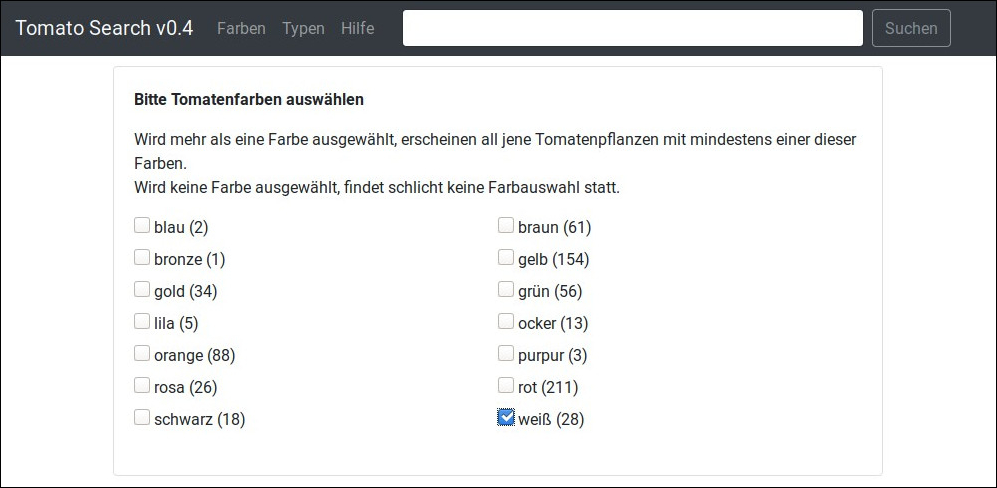
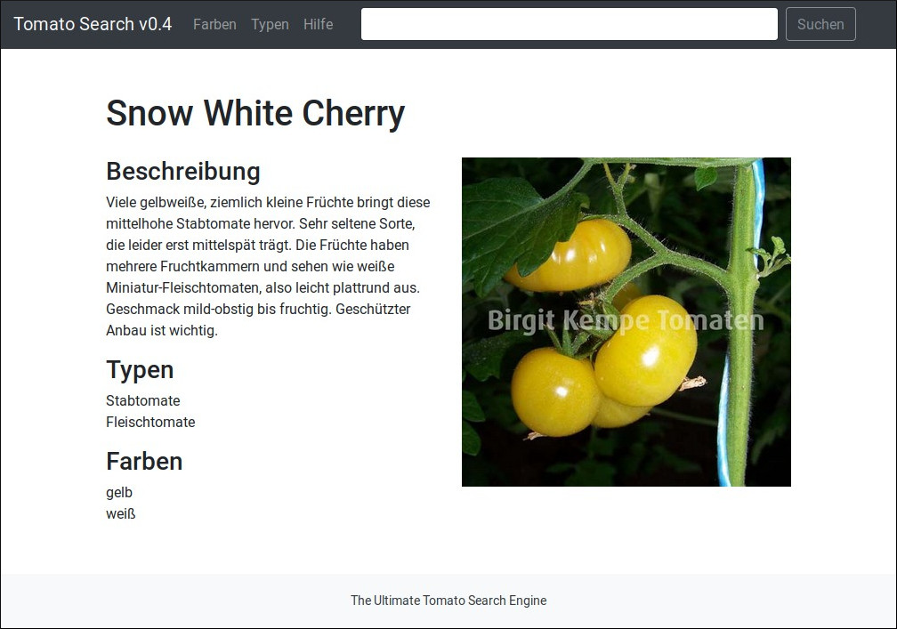

# Tomato Search Engine
A search engine re-implementing the website [Birgit Kempe Tomaten](https://www.birgit-kempe-tomaten.de/) listing ~400 tomato varieties using the Django Python framework. Tomatoes can be searched by color, by type, by name and by keyword in the description.

## Features
The [Tomato Fetch Engine](https://github.com/charismatic-claire/tomato-fetch-engine) produced an enriched dataset of ~400 tomato varieties originally stemming from the website mentioned above. Compared to that website, this web application allows the user to search tomatoes by color, by type, my name and by description. Results are shown in an images search engine like fashion. See the demo below.

### (1) Select a color, like "white"


### (2) Select a type, like "stake tomato" and add a search keyword like "small"


### (3) Search yields to 6 results


### (4)  Show result page for "Snow White Cherry"


## How to run using Docker on Linux
* Make sure you already scraped all the data with the "Tomato Fetch Engine"
* If you did not already do so, do it now, like this:
```
$ cd tomato-fetch-engine
$ ./run.sh
```

* Enter this project and navigate to the `tse` folder of the Docker service stack like this
```
$ cd tomato-search-engine/docker/tse/
```

* Copy the resulting archive from the `Tomato Fetch Engine` into the `web` folder of the Docker service stack
```
$ cp -rv ../../../tomato-fetch-engine/res.tar.gz web/
```

* Present files in the Docker service stack folder should look like this now:
```
$ tree
.
├── db
│   ├── Dockerfile
│   └── init.sql
├── docker-compose.yml
└── web
    ├── app.tar.gz
    ├── Dockerfile
    ├── requirements.txt
    ├── res.tar.gz
    └── run.sh
```

* First build and start the `db` service. It just starts a PostgreSQL 11 database server and initializes the database with three tables.
```
$ docker-compose up db
```

* If successful, the last logger line should read like this:
```
... [1] LOG:  database system is ready to accept connections
``` 

* If this service is up and running, start the `web` service. If started the first time, this populates the database and starts the Python web application.
```
$ docker-compose up web
```

* If successful, the last logger line should read like this:
```
Quit the server with CONTROL-C.

``` 

* Now visit [localhost:8080](http://localhost:8080) and see the web application up and running:


## License
GPL-3.0-or-later

